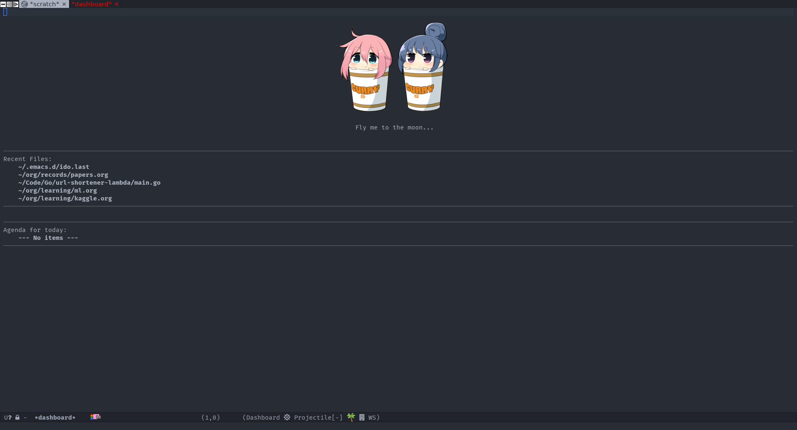

# Overview

`dotfiles` is managed with [GNU Stow](https://www.gnu.org/software/stow/manual/stow.html).
Simply integrate config with `stow <package>`.

Some demo images:

+ Vim with tmux


+ Emacs




## Basic OS setup

+ Arch: `Arch/Arch.md`

+ FreeBSD: `FreeBSD/FreeBSD.md`


## SSH

Generate SSH key:

```
ssh-keygen -t rsa -b 4096
```


## Git

```
git config --global user.email $MY_EMAIL
git config --global user.name $MY_USERNAME
git config --global core.editor "vim"
```

+ GPG:

    ```
    gpg --full-gen-key
    git config --global user.signingkey $MY_KEY
    gpg --armor --export $MY_KEY
    ```


## Shell

### Zsh

* [Prezto](https://github.com/sorin-ionescu/prezto)

    + Setup:

    ```
    git clone --recursive https://github.com/sorin-ionescu/prezto.git "${ZDOTDIR:-$HOME}/.zprezto"

    setopt EXTENDED_GLOB
    for rcfile in "${ZDOTDIR:-$HOME}"/.zprezto/runcoms/^README.md(.N); do
      ln -fs "$rcfile" "${ZDOTDIR:-$HOME}/.${rcfile:t}"
    done

    chsh -s /bin/zsh
    ```

    + Update:

    ```
    git pull origin master
    git submodule update --init --recursive
    ```

    + Install config:

        ```
        ./prezto.sh
        ```


* [FZF](https://github.com/junegunn/fzf.git)

    * Install:

    ```
    git clone --depth 1 https://github.com/junegunn/fzf.git ~/.fzf
    ~/.fzf/install
    ```

    * Ripgrep fusion:

    In `~/.zshrc`:

    ```
    export FZF_DEFAULT_COMMAND='rg --files --no-ignore --hidden --follow --glob "!.git/*"'
    ```

    * Update:

    ```
    cd ~/.fzf && git pull && ./install
    ```


### Fish

+ [Oh my Fish](https://github.com/oh-my-fish/oh-my-fish):

    + setup:

    ```
    https://github.com/oh-my-fish/oh-my-fish
    ```

## Terminal

+ Termite: Config goes with themes, see example installation in `./termite.sh`

+ Urxvt: custom config with `~/.Xcustom`


## Tmux

+ Tmux config for user:

```
git clone https://github.com/tmux-plugins/tpm ~/.tmux/plugins/tpm
```

+ Go into a tmux session and install plugins:

```
Prefix + I
```

+ To update plugins:

```
Prefix + U
```


## Vim

+ Plugins managed with [vim-plug](https://github.com/junegunn/vim-plug#installation), install with:

```
curl -fLo ~/.vim/autoload/plug.vim --create-dirs \
    https://raw.githubusercontent.com/junegunn/vim-plug/master/plug.vim
```

+ Then in vim:

```
:PlugInstall
```

+ To update all plugins:

```
:PlugUpdate
```

*Note*: Some plugins require [Powerline](https://github.com/powerline/fonts) and Awesome fonts.


+ Custom config: '~/.custom.vim'


## IBus

In `~/.xinitrc`:

```
export GTK_IM_MODULE=ibus
export XMODIFIERS=@im=ibus
export QT_IM_MODULE=ibus
ibus-daemon -drx
```
